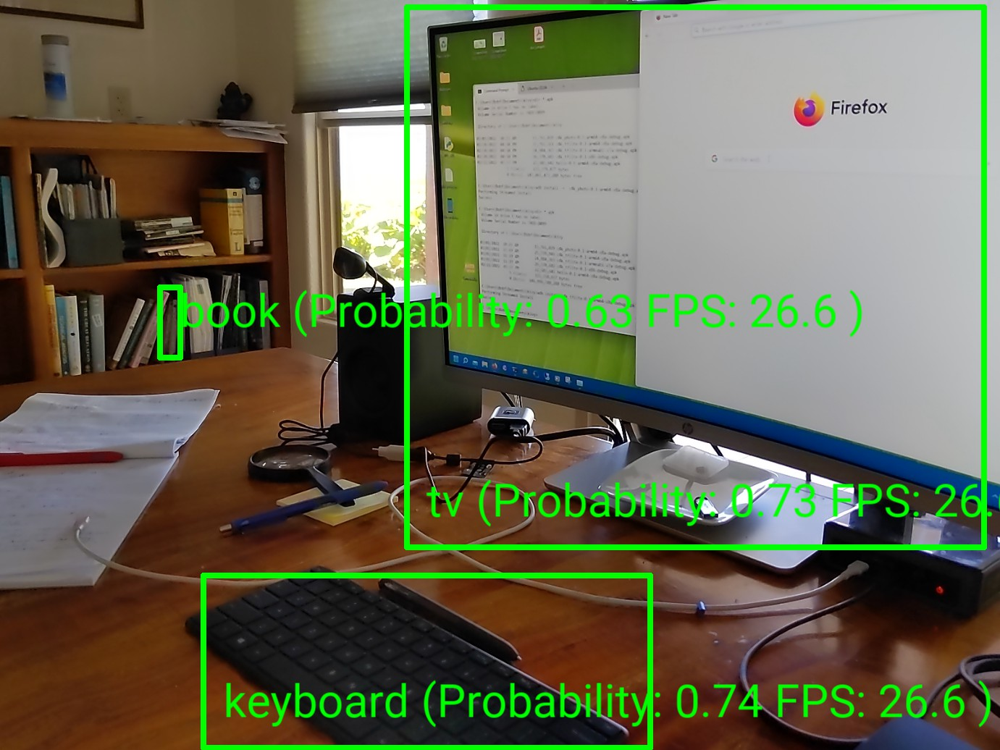

Camera4Kivy Tensoflow Lite Example
==================================

*Tensorflow Lite Image Analysis using Camera4Kivy*

# Overview

Uses Tensoflow Lite to classify objects in the image stream, classified objects are boxed and labeled in the Preview. 

Available on some of the [usual platforms](https://github.com/Android-for-Python/Camera4Kivy/#tested-examples-and-platforms).

This example is based on a [Tensorflow Lite Object Detection Example](https://github.com/tensorflow/examples/tree/master/lite/examples/object_detection/raspberry_pi). This example was trained on the [COCO dataset](https://cocodataset.org/#home) which contains 1000 objects commonly found in American houses. For example chair, person, cup, etc. It exhibits false positives, a picture on the wall is classified as a TV.

 

The original Google example depends on numpy and opencv. This derived example removes the `opencv.resize` usage, and uses `self.auto_analyze_resolution` to set the resolution required by the example. This was done to decrease apk size (no opencv) and increase performance on faster devices. 

This Google example was chosen because it was trained on a complex dataset and thus slow to infer objects, and so is a test of any performance limitations. Detection update rates and detection confidence vary by platform, because platforms use different delegates. The NNAPI delegate, available on Android >= 11 seems to be the fastest.

For this example platform performance is approximately:

| Platform | tflite version | approx annotations per sec|
|----------|----------------|-----------------------|
| Windows i7 | 2.5.0.post1 | 0.7  |
| Emulator x86 (Windows i7) | 2.8.0 | 1 |
| Mac i5 | 2.5.0.post1 | 3  |
| Nexus5 Android 6 arm7 | 2.8.0 | 5 |
| Windows + Coral | 2.5.0.post1 | 7 |
| Pixel5 Android 12 arm8 | 2.8.0 | 25 |

These are annotation update rates, for Camera4Kivy background image frame update rates are mostly independent of this. Surprisingly single digit annoatation rates provide acceptable behavior, this is because of the stochastic nature of detection. Conversly a high update rate appears too fast, tuning might be required.

As of 2021/12/13 Google's `tflite_runtime.whl` (version 2.5.0.post1) is not available for any of these: Python 3.10, MacOS on M1, MacOS Monterey, iOS, or x86_32. **If you use any of these, stop now**. If you have a problem with this talk to Google.

A recipe for `tflite-runtime` on Android is included in this example, it uses tflite-runtime 2.8.0, and runs on arm7 and arm8 devices and the x86 (but not x86_64) emulator.

# Image Analysis Architecture

Tensorflow Image analysis has four distinct components:

- The tensorflow lite model, formated to include tensor labels. Created for example with [Model Maker](https://www.tensorflow.org/lite/guide/model_maker) and also [here](https://www.tensorflow.org/lite/api_docs/python/tflite_model_maker).

- The Python `tflite-runtime` package. This performs inference based on the model and the input image. This package is available from Google on most desktops, and using the p4a recipe on Android.

- The model interface, specific to the tflite model, in this case [`object_detection/object_detector.py`](https://github.com/Android-for-Python/c4k_tflite_example/blob/main/object_detection/object_detector.py). This encodes the model input, executes the runtime, and decodes the output.

- The Camera4Kivy interface [classifyobject.py](https://github.com/Android-for-Python/c4k_tflite_example/blob/main/classifyobject.py). This passes the image to the model interface, and annotates the output to the Preview widget.

# tflite-runtime Documentation

[Python API](https://www.tensorflow.org/lite/api_docs/python/tf/lite), 
[Python quickstart](https://www.tensorflow.org/lite/guide/python), and 
[21 Python examples](https://github.com/tensorflow/examples/tree/master/lite/examples).

# Install

This example depends on [Camera4Kivy](https://github.com/Android-for-Python/Camera4Kivy#camera4kivy). Depending on the platform you may need to install a [camera provider](https://github.com/Android-for-Python/Camera4Kivy#camera-provider). 

## Windows, MacOS x86_64, Linux
`pip3 install numpy camera4kivy`

(The currently available version of tflite-runtime maybe different to the one used on the next line.)

`pip3 install --index-url https://google-coral.github.io/py-repo/tflite-runtime==2.5.0.post1`

If you use a [Coral Accelerator](https://coral.ai/products/accelerator) set `enable_edgetpu = True` in `classifyobject.py`.

## Android

The example includes a `tflite-runtime` recipe, a `buildozer.spec`, and `camerax_provider`. 

The buildozer.spec has these characteristics:

```
source.include_exts = ...,tflite
source.exclude_patterns = object_detection/efficient*.tflite
requirements = python3,kivy,camera4kivy,gestures4kivy,numpy,tflite-runtime
android.api = 31
android.arch = arm64-v8a
p4a.branch = develop
p4a.local_recipes = p4a-recipes
p4a.hook = camerax_provider/gradle_options.py
```

Note armeab-v7a: Some very old armeab-v7a devices may not have NEON instructions and will not work (the failure mechanism, if any, is unknown). Set `android.minapi = 23` to exclude these devices (and some devices that do have NEON instructions as well).

Note x86_84: Build fails.